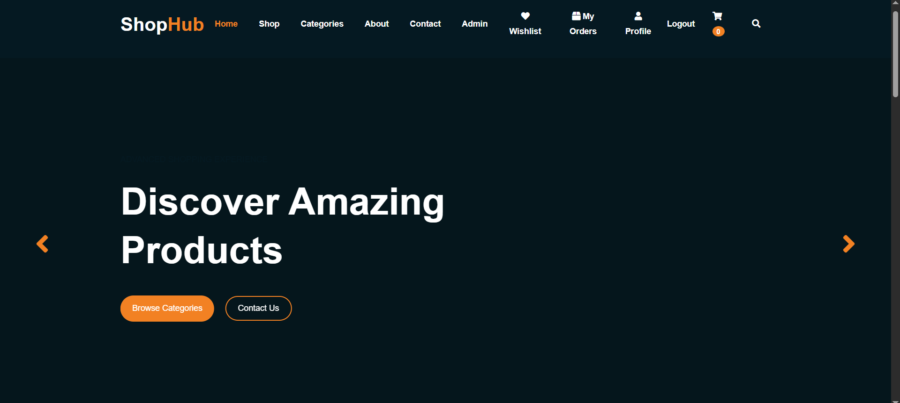

# 🛒 Ecommerce Laravel Project

Professional ecommerce website built with Laravel.

---

## 📸 Screenshots



---

## 🚀 Features

- User Authentication
- Product Management
- Categories
- Shopping Cart
- Wishlist
- Orders System
- Coupons
- Reviews
- Admin Dashboard
- Payment Flow

---

## 🛠️ Built With

- Laravel
- PHP
- MySQL
- Bootstrap
- JavaScript
- Blade Template Engine

---

## ⚙️ Installation

Clone the repository:

```bash
git clone https://github.com/ahmedFathy-22/ecommerce-laravel.git
```

Go to project folder:

```bash
cd ecommerce-laravel
```

Install dependencies:

```bash
composer install
```

Create env file:

```bash
cp .env.example .env
```

Generate application key:

```bash
php artisan key:generate
```

Configure database inside `.env`

Run migrations:

```bash
php artisan migrate
```

Start server:

```bash
php artisan serve
```

---

## 👨‍💻 Author

Ahmed Fathy
